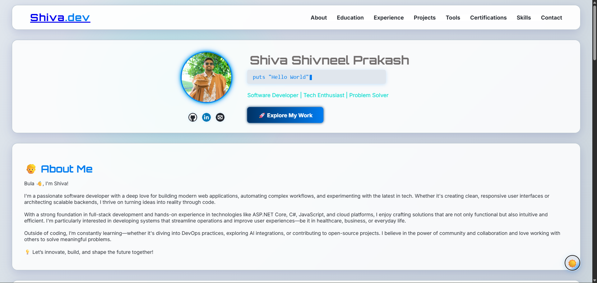

# shivneelprakash.github.io

Welcome to my personal portfolio website!  
This project showcases my skills, experience, projects, certifications, and contact information as a software developer.

## 🚀 Features

- **Responsive Design:** Looks great on desktop and mobile devices.
- **About Me:** Brief introduction and background.
- **Education & Experience:** Timeline with logos and details.
- **Projects:** Highlighted projects with live demos and descriptions.
- **Certifications:** Interactive section to view certificates.
- **Skills & Tools:** Visual display of programming languages, frameworks, and tools.
- **Contact:** Easy way to reach out via email.

## 🛠️ Built With

- **HTML5 & CSS3** (custom styles, Flexbox, responsive design)
- **JavaScript** (for interactivity and animations)
- **[Simple Icons](https://simpleicons.org/)** (for technology logos)
- **[Devicon](https://devicon.dev/)** (for developer icons)
- **VS Code** (recommended for editing)

## 📂 Project Structure

```
.
├── assets/
│   ├── certs/         # Certificate images
│   ├── imgs/          # Logos, profile, project images
├── scripts/
│   └── main.js        # JavaScript for interactivity
├── styles/
│   └── style.css      # Main stylesheet
├── index.html         # Main website file
└── README.md
```

## 🖼️ Screenshots

 <!-- Add a screenshot if available -->

## 📦 Getting Started

1. **Clone the repository:**
   ```bash
   git clone https://github.com/shivneel-prakash/shivneel-prakash.github.io.git
   ```
2. **Open `index.html` in your browser.**
3. **(Optional) Edit content and images to personalize.**

## 🌐 Live Demo

Visit: [shivneel-prakash.github.io](https://shivneel-prakash.github.io/)

## 📧 Contact

- **Email:** shivneelprakash@gmail.com
- **LinkedIn:** [linkedin.com/in/shivneelprakash](https://linkedin.com/in/shivneelprakash)
- **GitHub:** [github.com/shivneel-prakash](https://github.com/shivneel-prakash)

## 📝 License

This project is open source and available under the [MIT License](LICENSE).

---

> Made with 🫶 by Shiva Shivneel Prakash